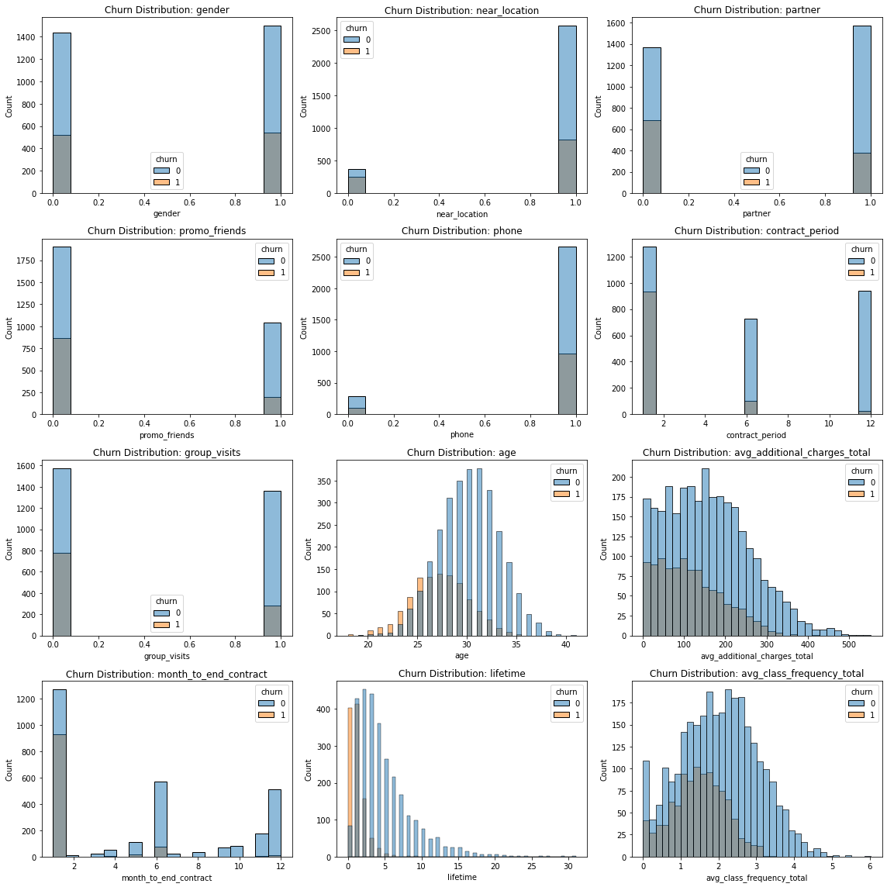

# Data Analyst Portfolio

This is my portfolio from Yandex 100 Practicum

## Project 1. Car sales analysis

In this project we analyze car sales on the site

LINK: [project](car_sales)

## Project 2. A/B testing international online store

LINK: [project](ab_test_online_store)

## Project 3. A/B Test to Inform Business Decisions

LINK: [project](ab_test_prioritize_hypotheses)

## Project 4. Business metrics of Yandex.Afisha

LINK: [project](business_metrics_yandex_afisha)

## Project 5. Video Games Sales Data Analysis

LINK: [project](video_games_sales)

### The goal of the project:
Based on the data about users and expert reviews, genres, platforms, 
and historical data on game sales, identify patterns that determine 
whether the game is successful or not to plan the advertising campaigns 
for online store.
### Skills:
Data cleaning, data analysis, descriptive statistics, central limit theorem,
hypothesis testing, data visualization.
### Technologies and libraries:
Python, Pandas, Numpy, Scipy Stats, Seaborn, Plotly.
### Conclusions and basic recommendations:
We can see the total annual revenue for console games declining. They were at their peak in 2004, now their popularity is falling. My guess is that this is due to the growing market for mobile video games (or another type of video game that is gaining popularity: virtual reality). Regionally, North America is the largest market (percentage of total games sold over the past five years), followed by Japan. The gaming industry is quite specific, and in the graphs above, we see how strongly the region in which the researched user is located affects. the user profile by region shows us that the CC platform is the most popular in Japan, which is not even included in the top 5 most popular user platforms in America and Europe. For greater success, I propose to divide the purchased types of video games depending on the region where the store is located in accordance with the user profiles that we have compiled. Here are the user's profiles for each region and let's take into account mainly those platforms that are at the peak of popularity or are gaining popularity:

North America. NA has the largest share of the consumer video games market. The most popular platforms in this region are X360, PS3, PS4, Xone, and 3DS. But taking into account the research conducted, I propose to focus on sales on the PS4 and XOne platforms. Here is the list of the most popular genres (in descending order): action, sport, shooter, platform, and misk.

Europe. The preferences of European users of video games do not differ much in terms of genres, the only difference is that the 5 most popular genres in Europe include not platform, but racing. As for the type of platform, we also see only one difference with the NA region: the PC, not the XOne.

Japan. For this region, I propose to promote video games on the PS4 platform, continue selling 3DS, and also two platforms that are popular only in Japan: PSP and PSV. The most popular genre in this region is role-playing, and further in descending order: action, misc, fighting, platform.

## Project 6. Customer Churn Prediction and Retention Strategy

LINK: [project](customer_churn_prediction_and_retention)

### The goal of the project:
Based on analytic data on customers profiles and interactions collected by 
the gym chain Model Fitness, to analyze customer profiles and, on their basis,
think over a customer retention strategy. Additional tasks of this project 
are drawing up a typical user profile, analyzing the factors affecting churn,
and making recommendations for customer service.
### Skills:
Data cleaning, detecting data anomalies, data visualization, descriptive analytics, 
correlation matrix, logistic regression, random forest, model's metrics, 
confusion matrix, users clusters, train model to predict user churn.
### Technologies and libraries:
Python, Pandas, Numpy, Sklearn, Scipy, Plotly, Matplotlib, Seaborn.
### Conclusions and basic recommendations:
Based on the research above, I have developed some suggestions and
recommendations.

<ul>  
    <li>First of all, I want to note the large churn of clients with contracts for one month and who leave the gym and no longer return after a few sessions.  there is a need to create an interest in continuing to use the gym services and motivational policies in order for them to renew their contracts.  for this purpose, I propose to create user cards with the possibility of accumulating points and subsequently exchanging these points for rewards.  for example, additional services of the gym (cafe, swimming pool, etc.), free classes or master classes.</li>
    <li>My next suggestion is to offer promotions and discounts for those who renew the contract.  As we noticed in our research, we have the lowest customer churn for that group of customers who signed a contract for a year, therefore, we need to strive to ensure that users switch from short-term to long-term contracts</li>
    <li>Creating a feedback system for improving gym services and eliminate deficiences, especially feedback from users who decide to leave the gym. We need to ask them their reasons for leaving, suggestions they have and what we can do to get them to stay.</li>
    <li>Membership freeze. This option will help us to return customers who temporarily can not to visit the gym, but which are planning to return in the feature. In this way we will become more customer-oriented, and it will give us an advantage over other gyms.</li>
</ul>

## Project 7. A/A/B Test to Inform Business Decisions

LINK: [project](aab_test_business_decisions)