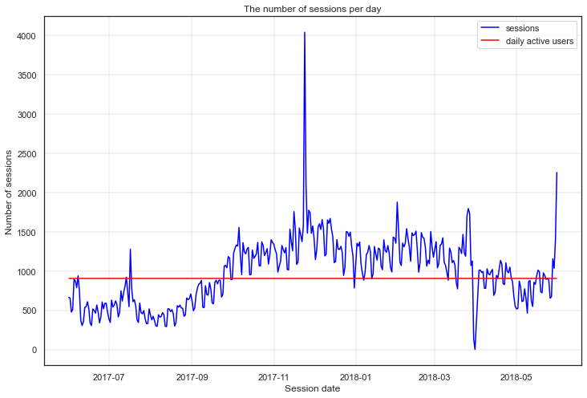
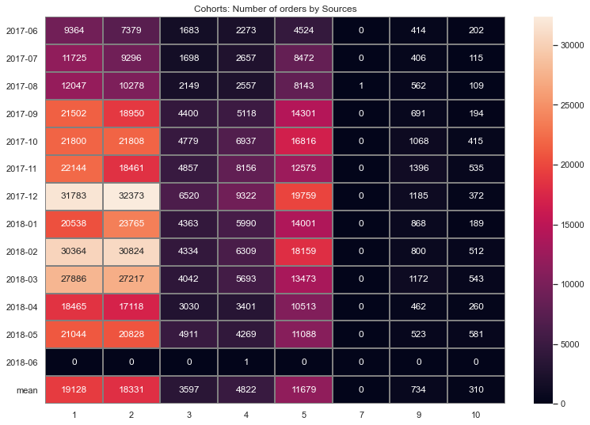

# Data Analyst Portfolio

## Business Metrics of Yandex Afisha

As an intern in the analytical department at Yandex.Afisha my task is 
to analyze the business metrics of Yandex.Afisha, an app that helps users 
find out about events like movie showings, exhibitions, gigs, etc. and buy 
tickets. My goal is to help marketing experts from Yandex.Afisha make 
effective investments in marketing, i.e. optimize marketing expenses.

Description of the data

The visits table (server logs with data on website visits):
* Uid — user's unique identifier
* Device — user's device
* Start Ts — session start date and time
* End Ts — session end date and time
* Source Id — identifier of the ad source the user came from 
All dates in this table are in YYYY-MM-DD format.

The orders table (data on orders):
* Uid — unique identifier of the user making an order
* Buy Ts — order date and time
* Revenue — Yandex.Afisha's revenue from the order

The costs table (data on marketing expenses):
* source_id — ad source identifier
* dt — date
* costs — expenses on this ad source on this day

### 1. Exploratory Data Analysis. Product

On this step of our investigation we'll calculate and analyze the product metrics, such as users activities, number of session on given period of time, length of each session and how often users come back to the product.

This graph shows the number of sessions by session date versus the average 
number of daily active users. The number of log ons grown rapidly on 
December 2017 with peak on the end of the month, and began to decline on
January 2018. Maybe the reason is New Year or the sales to the end of the 
year. Or also a possible reason - the weekend on the New Year holidays. 
Before October 2017 the number of sessions per day were less than the average 
number of users how log on to the Yandex.Afisha (the same tendency we can see 
on April/May 2018).

