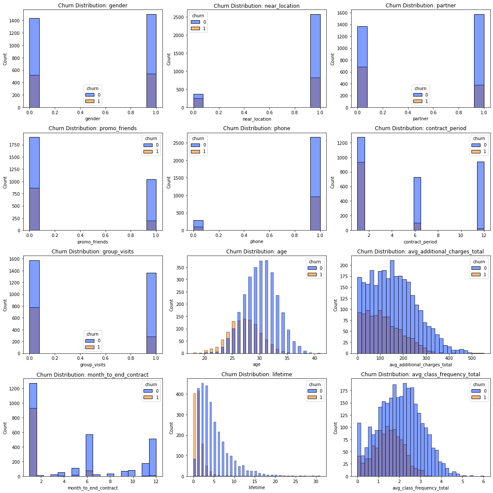
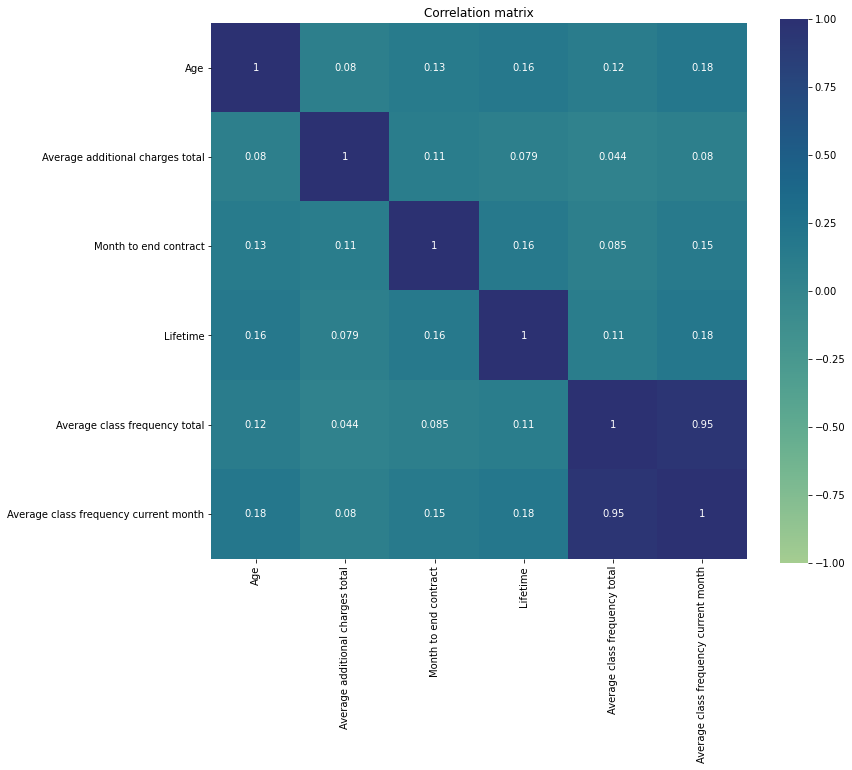
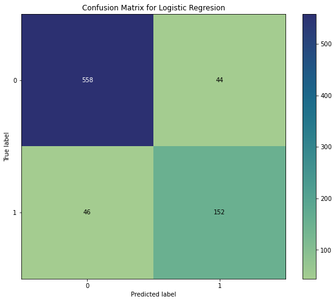
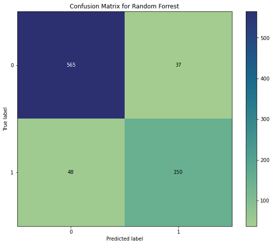
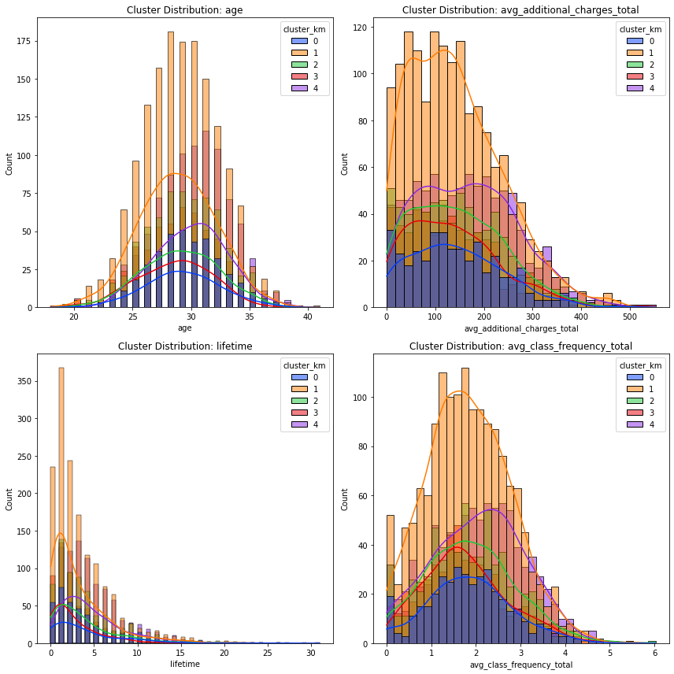

# Data Analyst Portfolio

## Customer churn prediction and retention strategy

### The goal of the project

Based on analytic data on customers profiles and interactions collected by the gym chain Model Fitness, to analyze customer profiles and, on their basis, think over a customer retention strategy. Additional tasks of this project are drawing up a typical user profile, analyzing the factors affecting churn, and making recommendations for customer service.

### 1. Exploratory data analysis

#### Clean data and drawing first conclusions. Data divided into two groups: churn and stay, and plotted feature distributions.

According to the graphs above we can draw some interesting conclusions:
<ul>
    <li>Age distribution: the peak of churn customers 25-27 years, the peak of staying customers 30-32 years.</li>
    <li>Month to end contract distribution: peak of churn 6 months, the peak of stay customers 1-2 months.</li>
    <li>Lifetime distribution: we can see a significant peak in the churn of visitors at 0 and 1 lifetime.</li>
    <li>Average frequency total distribution: there is no pronounced peak in the number of remaining users, the indicator varies frm 1 to 3 visits per week, there is also a large number of users visiting th gym 4 times a week, while the churn peak occurs at 1 to 2 visits per week.
    <li>More people who did not have partners churned over people with partners. Same for people with group visits</li>
    <li>The highest churn by internet service is accounted for users with contract period of one month and very low churn rate for users with contract of 12 months.</li>
</ul>

#### Correlation matrix

The correlation matrix above shows a strong dependency between two features: Average class frequency total and Average class frequency current month, the features have a correlation of about 0.95 which indicates presence of multicollinearity between the two variables. We can drop Average class frequency current month.

### 2. Choosing model

The main task of this step of our project is to build an optimal model 
to predict user churn. I will train the model on the train set with 
two methods: logistic regression and random forest. Lastly, I'll evaluate 
accuracy, precision, and recall for both models using the validation data. 
Based on the calculated metrics and on the plotted confusion matrices for 
each of the models, I'll choose tho most accurate model.

Our Random forest model performed a little better than the logistic 
regression by catching 92% of the true cases (91% using the 
logistic regression) in the unseen/validation set and had an ROC_AUC 
of 0.97 (0.96 using logistic regression). It's a good results, 
but since our logistic regression and random forest model performed more 
or less the same, It's a good idea to go with the simpler and more 
interpretable model that is the logistic regression for the choice of model.

### 3. Create user clusters

I use Hierarchical clustering to get the optimal number of clusters to predict user churn.

The suggested optimal number of clusters corresponds to the five different colors on the plot.

#### Predict customer clusters and feature distribution

### Main conclusion

Based on the above research, I have developed some suggestions and recommendations.
<ul>  
    <li>First of all, I want to note the large churn of clients with contracts for one month and who leave the gym and no longer return after a few sessions.  there is a need to create an interest in continuing to use the gym services and motivational policies in order for them to renew their contracts.  for this purpose, I propose to create user cards with the possibility of accumulating points and subsequently exchanging these points for rewards.  for example, additional services of the gym (cafe, swimming pool, etc.), free classes or master classes.</li>
    <li>My next suggestion is to offer promotions and discounts for those who renew the contract.  As we noticed in our research, we have the lowest customer churn for that group of customers who signed a contract for a year, therefore, we need to strive to ensure that users switch from short-term to long-term contracts</li>
    <li>Creating a feedback system for improving gym services and eliminate deficiences, especially feedback from users who decide to leave the gym. We need to ask them their reasons for leaving, suggestions they have and what we can do to get them to stay.</li>
    <li>Membership freeze. This option will help us to return customers who temporarily can not to visit the gym, but which are planning to return in the feature. In this way we will become more customer-oriented, and it will give us an advantage over other gyms.</li>
</ul>