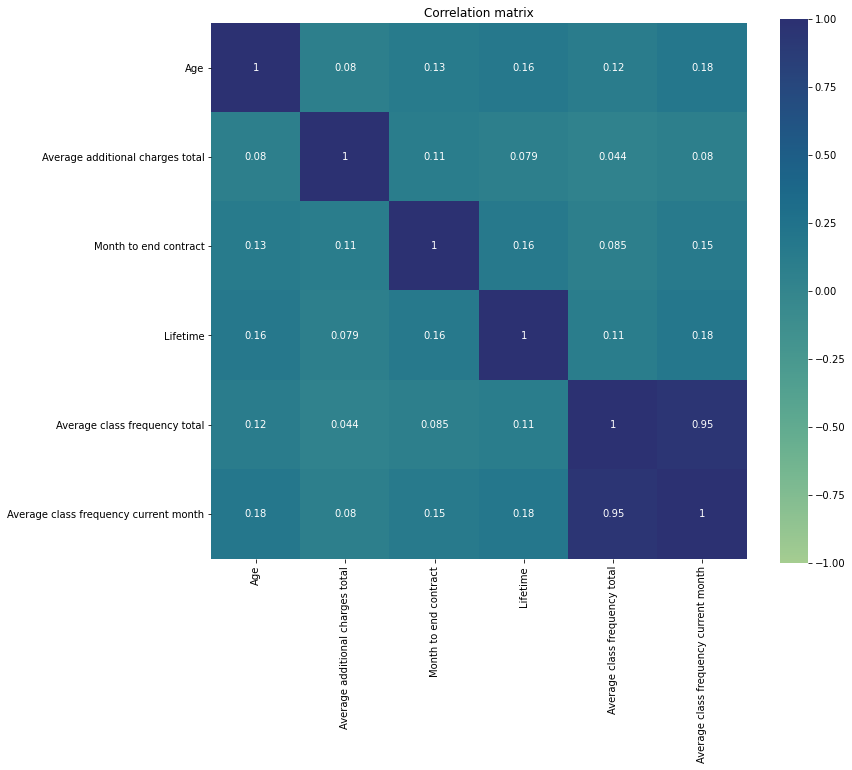
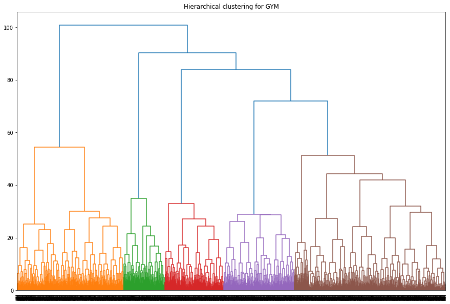
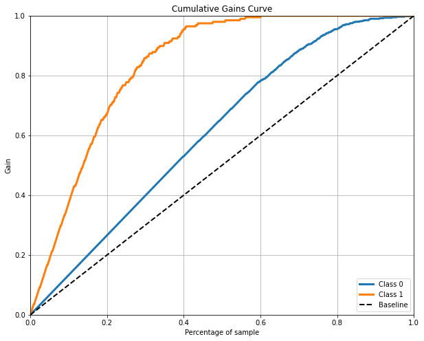

# Data Analyst Portfolio

## Customer churn prediction and retention strategy

In this project, I analyzed customer profiles and interactions data collected by the gym chain Model Fitness to develop a customer retention strategy. Using data analytics techniques, I identified typical user profiles and analyzed the factors that contribute to customer churn. Based on my findings, I made recommendations for improving customer service and retention.

The project involved several key steps, including data cleaning and wrangling, exploratory data analysis, and predictive modeling. I used Python to perform the analysis and visualization.

Some of the key insights I gained from the project include identifying the most significant factors that contribute to customer churn, such as age, frequency of visits, and length of membership. Using this information, I developed a customer retention strategy that involved targeted marketing campaigns and personalized customer service.

Overall, this project showcases my skills in data cleaning, data analysis, and predictive modeling, as well as my ability to translate data insights into actionable recommendations for businesses.
### 1. Exploratory data analysis

#### Clean data and drawing first conclusions. Data divided into two groups: churn and stay, and plotted feature distributions.
 

According to the graphs above, we can draw some interesting conclusions: 

- From the age distribution graph, we can see that the peak of churn customers is 25-27 years old, while the peak of staying customers is 30-32 years old. This suggests that Model Fitness needs to focus on retaining younger customers.
 
- The month to end contract distribution shows that the peak of churn is at 6 months, while the peak of stay customers is at 1-2 months. Therefore, we recommend that Model Fitness should offer attractive loyalty programs to customers who are approaching the end of their 6-month contract to encourage them to renew.
 
- The lifetime distribution graph indicates a significant peak in churn of visitors at 0 and 1 lifetime. This suggests that Model Fitness needs to improve their onboarding process for new customers to ensure they are engaged and committed to using the gym.
 
- The average frequency total distribution graph shows that there is no pronounced peak in the number of remaining users, and the indicator varies from 1 to 3 visits per week. There is also a large number of users visiting the gym 4 times a week. The churn peak occurs at 1 to 2 visits per week. Therefore, Model Fitness should focus on encouraging customers to increase their gym visits, offering incentives for more frequent attendance.
 
- Furthermore, we found that more people without partners churned than people with partners, and the same for people with group visits. This suggests that Model Fitness should consider introducing social events and activities to help single customers connect with others in the gym community and build relationships.
 
- Finally, we discovered that the highest churn is accounted for users with a contract period of one month, while there is a very low churn rate for users with a contract of 12 months. Therefore, Model Fitness should consider offering attractive discounts and incentives for longer contract periods to encourage customers to commit to a longer-term membership.
 
Overall, based on these findings, we recommend that Model Fitness should focus on improving customer engagement, building relationships within the gym community, and offering attractive loyalty programs to improve customer retention rates.
Overall, these insights highlight the importance of understanding customer behavior and preferences in order to develop effective retention strategies. By analyzing the data and drawing these conclusions, we can make more informed decisions about how to improve customer service and reduce churn rates.

#### Correlation matrix
 

 

The correlation matrix indicates a strong correlation between the Average class frequency total and Average class frequency current month features, with a correlation coefficient of around 0.95. This suggests the presence of multicollinearity between these two variables. To avoid issues with multicollinearity, it may be best to remove one of these variables from the analysis.
 
### 2. Choosing model 

In the second step of our project, we aimed to build an optimal model to predict user churn. We trained two models, logistic regression and random forest, on the training set and evaluated their accuracy, precision, and recall using the validation data. After analyzing the calculated metrics and the plotted confusion matrices, we chose the most accurate model.

 
We built Receiver Operating Characteristic (ROC) curves for both models and calculated their Area Under the Curve (AUC) to compare their performances. Our logistic regression and random forest models both performed well, with AUC values of 0.95 and 0.94, respectively. However, the logistic regression model had a higher ROC curve, indicating better performance at the given threshold. 
 

#### Conclusion
 
To choose the better model we'll look at the calculated metrics for  both models.

- Accuracy. When comparing the calculated metrics for both models, we found that accuracy was the same for both models. 
- Precision. Random forest had a slightly higher precision of 0.8 compared to 0.78 for logistic regression, indicating that the random forest model was more accurate in identifying positive samples as positive and not negative. 
- Recall. However, logistic regression had a slightly higher recall of 0.77 compared to 0.76 for random forest, indicating that logistic regression was better at detecting all positive samples. 
- F1 or harmonic mean of the precision and recall. The F1 score was 0.77 for logistic regression and 0.78 for random forest. 
- ROC AUC. Logistic Regression evaluates best result 0.95, then Random Forrest(0.94). 

Overall, while both models performed similarly, we chose the logistic regression model as it is simpler and more interpretable. 

### 3. Create user clusters
 
In this step, I used Hierarchical clustering to determine the optimal number of clusters for predicting user churn.
 

 
The suggested optimal number of clusters corresponds to the five different colors on the Hierarchical clustering chart.
 

#### Predict customer clusters and feature distribution

 

 
Graphs above show the cluster distribution for each relevant continuous feature with clusters segregation.
Let's take a closer look at each graph.

- Cluster distribution by Age: We can see that clusters 0, 2, and 3 have a peak in the age range of 28-30 years, while for cluster 1, we see an offset to the left side and for cluster 4, an offset to the right side. 
- Cluster distribution by Average additional charges total: Clusters 0, 1, 2, and 3 fall in the range of 50-150 units. However, cluster 4 has two peaks in the distribution, which are in the ranges of 50-100 and 150-220 units. This indicates that customers in cluster 4 prefer to get additional services in the gym. 
- Cluster distribution by Lifetime: The peak of each cluster is around 2 lifetimes, except for cluster 4, which has a peak around 3-4 lifetimes. 
- Cluster distribution by Average class frequency total: The visit frequency for clusters 0 and 3 is 1-2 times a week, for clusters 0 and 2, the frequency is 2 times a week, and for cluster 4, the frequency is between 2 and 3 times a week. 

<table>
    <caption>Churn rate for each cluster:</caption>
    <tr>
        <th>Cluster</th>
        <th>Churn rate</th>
    </tr>
    <tr>
        <th>0</th>
        <th>0.267</th>
    </tr>
    <tr>
        <th>1</th>
        <th>0.359</th>
    </tr>
    <tr>
        <th>2</th>
        <th>0.247</th>
    </tr>
    <tr>
        <th>3</th>
        <th>0.429</th>
    </tr>
    <tr>
        <th>4</th>
        <th>0.020</th>
    </tr>
</table>

Furthermore, the table above shows the churn rate for each cluster, where we can observe that customers in clusters 4 and 2 have the lowest churn rates, which is only 0.020 and 0.247 respectively. This information can be useful in creating retention strategies for these two clusters to maintain their loyalty to the gym.

To measure model performance I'll use Cumulative gains chart.

Based on the graph above we can conclude, the curve for the developed Logistic regression model suggests a better performance than for the random model. According to the Cumulative Gaines Curve, if we approach 20% of our customer base (x-axis), we will get about 75% of all the positive answers (y-axis). With the top 30% of our customer base we can find a whooping percentage of 90% of all positive answers and so on so forth.

  <h2>Conclusions and Recommendations</h2>
  
Based on the research, we have developed the following suggestions and recommendations:

  - First of all, I want to note the large churn of clients with contracts 
for one month and who leave the gym and no longer return after a few sessions.  
There is a need to create an interest in continuing to use the gym services
and motivational policies in order for them to renew their contracts. For this purpose, I propose to create user cards with the possibility 
of accumulating points and subsequently exchanging these points for rewards. 
For example, additional services of the gym (cafe, swimming pool, etc.), 
free classes or master classes. 
- My next suggestion is to offer promotions and discounts for those 
who renew the contract.  As we noticed in our research, we have the lowest 
customer churn for that group of customers who signed a contract for a year,
therefore, we need to strive to ensure that users switch from short-term 
to long-term contracts. 
- Creating a feedback system for improving gym services and eliminate
deficiencies, especially feedback from users who decide to leave the gym to develop retention strategy. 
We need to ask them their reasons for leaving, suggestions they have and 
what we can do to get them to stay. 
- Membership freeze. This option will help us to return customers 
who temporarily can not to visit the gym, but which are planning to return
in the feature. In this way we will become more customer-oriented, 
and it will give us an advantage over other gyms.

  <h3>User Retention Strategies:</h3>
  <ul>
    <li>Create user cards with the possibility of accumulating points and subsequently exchanging these points for rewards</li>
    <li>Offer promotions and discounts for those who renew their contracts</li>
    <li>Create a feedback system for improving gym services and eliminating deficiencies</li>
    <li>Implement a membership freeze option to retain customers who temporarily can not visit the gym</li>
  </ul>
  
  <h3>Model Recommendation:</h3>
  
Based on the evaluation metrics, we recommend using the logistic regression model for predicting user churn.

  
  <h3>Future Research:</h3>
  
Further research could be done on:

  <ul>
    <li>Correlating user demographic data with churn rate to identify specific demographic groups that are more likely to churn</li>
    <li>Conducting A/B testing on the user retention strategies to measure their effectiveness</li>
    <li>Exploring the impact of external factors (e.g. economic downturns) on user churn</li>
  </ul>
