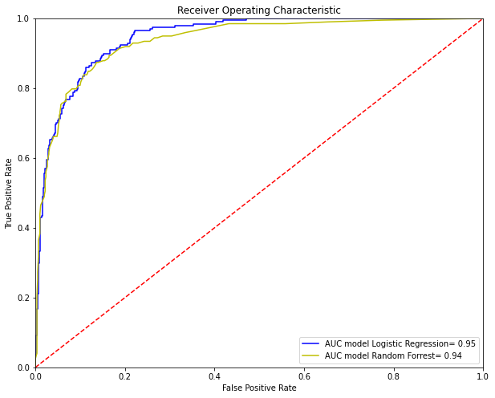

# Data Analyst Portfolio

## Customer churn prediction and retention strategy

### The goal of the project

Based on analytic data on customers profiles and interactions collected by 
the gym chain Model Fitness, to analyze customer profiles and, 
on their basis, develop a customer retention strategy. Additional tasks of this project are drawing up a typical user profile, analyzing the factors affecting churn, and making recommendations for customer service.

### 1. Exploratory data analysis

#### Clean data and drawing first conclusions. Data divided into two groups: churn and stay, and plotted feature distributions.

According to the graphs above we can draw some interesting conclusions:
<ul>
    <li>Age distribution: the peak of churn customers 25-27 years, the peak of staying customers 30-32 years.</li>
    <li>Month to end contract distribution: peak of churn 6 months, the peak of stay customers 1-2 months.</li>
    <li>Lifetime distribution: we can see a significant peak in the churn of visitors at 0 and 1 lifetime.</li>
    <li>Average frequency total distribution: there is no pronounced peak in 
the number of remaining users, the indicator varies from 1 to 3 visits per week, there is also a large number of users visiting th gym 4 times a week, while the churn peak occurs at 1 to 2 visits per week.
    <li>More people without partners churned than people with partners. Same for people with group visits</li>
    <li>The highest churn is accounted for users with contract period of one month and very low churn rate for users with contract of 12 months.</li>
</ul>

#### Correlation matrix

The correlation matrix above shows a strong dependency between two features: Average class frequency total and Average class frequency current month, the features have a correlation of about 0.95 which indicates presence of multicollinearity between the two variables. We can drop Average class frequency current month.

### 2. Choosing model

The main task of this step of our project is to build an optimal model 
to predict user churn. I will train the model on the train set with 
two methods: logistic regression and random forest. Lastly, I'll evaluate 
accuracy, precision, and recall for both models using the validation data. 
Based on the calculated metrics and on the plotted confusion matrices for 
each of the models, I'll choose tho most accurate model.

After predicting models I built Receiver Operating Characteristic Curve for two candidate models, to compare their performances. AUC, as the name suggests, is the covered area under the respective curve, higher values indicating a better model that is able to distinguish between the two classes.

Our two models perform particularly well, at 0.95 and 0.94. Model Logistic regression is obviously better than model Random Forrest. We can see that visually: at given threshold, model Logistic Regression presents better metrics than model Random Forrest and thus its curve is higher.

#### Conclusion

To choose the better model we'll look at the calculated metrics for  both models.
<ul>
<li>Accuracy: same value for Logistic Regression and Random Forrest.</li>
<li>Precision: 0.78 for Logistic Regression and 0.8 for Random Forrest. It means Random Forrest model is more accurate in identifying positive samples as positive and not negative.</li>
<li>Recall: 0.77 for Logistic Regression and 0.76 for Random Forrest. We can trust more the Logistic Regression in detecting all positive samples.</li>
<li>F1 or harmonic mean of the precision and recall: 0.77 for Logistic Regression and 0.78 for Randon Forrest.</li>
<li>ROC AUC: Logistic Regression evaluates best result 0.95, then Random Forrest(0.94).</li>
</ul>
There are good results, but since our logistic regression and random forest 
model performed more or less the same, It's a good idea to go with the 
simpler and more interpretable model that is logistic regression model.

### 3. Create user clusters

I use Hierarchical clustering to get the optimal number of clusters to 
predict user churn.

The suggested optimal number of clusters corresponds to the five different 
colors on the plot.

#### Predict customer clusters and feature distribution

Graphs above show the cluster distribution for each relevant continuous feature with clusters segregation.
Let's take a closer look at each graph.
<ul>
<li>Cluster distribution by Age:
on clusters 0, 2 and 3 the peak is on the range 28-30 years, for cluster 1 we see offset to the left side and for cluster 4 - to the right side.</li>
<li>Cluster distribution by Average additional charges total: clusters 0,1,2,3 are in the range 50-150 units, on this graph we can highlight cluster 4 with two peaks in the distribution: on the range 50-100 and 150-220. It means in cluster 4 we have clients who prefere to get additional services in the gym.</li>
<li>Cluster distribution by Lifetime: the peak of each cluster on the 2 lifetime, only cluster 4 is on the 3-4 lifetime.</li>
<li>Cluster distribution by Average class frequency total: visit frequency for clusters 0 and 3 is 1-2 times a week, for clusters 0 and 2 frequency 2 times a week, and for cluster 4 the frequency between 2 and 3 times a week.</li>
</ul>  

<table>
    <caption>Churn rate for each cluster:</caption>
    <tr>
        <th>Cluster</th>
        <th>Churn rate</th>
    </tr>
    <tr>
        <th>0</th>
        <th>0.267</th>
    </tr>
    <tr>
        <th>1</th>
        <th>0.359</th>
    </tr>
    <tr>
        <th>2</th>
        <th>0.247</th>
    </tr>
    <tr>
        <th>3</th>
        <th>0.429</th>
    </tr>
    <tr>
        <th>4</th>
        <th>0.020</th>
    </tr>
</table>

The table above shows the churn rate for each cluster. We see the lowest 
churn rates among customers who are in clusters 4 and 2.

To measure model performance I'll use Cumulative gains chart.

Based on the graph above we can conclude, the curve for the developed Logistic regression model suggests a better performance than for the random model. According to the Cumulative Gaines Curve, if we approach 20% of our customer base (x-axis), we will get about 75% of all the positive answers (y-axis). With the top 30% of our customer base we can find a whooping percentage of 90% of all positive answers and so on so forth.

### Main conclusion

Based on the research, I have developed some suggestions and recommendations.
<ul>
    <li>First of all, I want to note the large churn of clients with contracts 
for one month and who leave the gym and no longer return after a few sessions.  
There is a need to create an interest in continuing to use the gym services
and motivational policies in order for them to renew their contracts.  
For this purpose, I propose to create user cards with the possibility 
of accumulating points and subsequently exchanging these points for rewards. 
For example, additional services of the gym (cafe, swimming pool, etc.), 
free classes or master classes.</li>
    <li>My next suggestion is to offer promotions and discounts for those 
who renew the contract.  As we noticed in our research, we have the lowest 
customer churn for that group of customers who signed a contract for a year,
therefore, we need to strive to ensure that users switch from short-term 
to long-term contracts</li>
    <li>Creating a feedback system for improving gym services and eliminate
deficiencies, especially feedback from users who decide to leave the gym to develop retention strategy. 
We need to ask them their reasons for leaving, suggestions they have and 
what we can do to get them to stay.</li>
    <li>Membership freeze. This option will help us to return customers 
who temporarily can not to visit the gym, but which are planning to return
in the feature. In this way we will become more customer-oriented, 
and it will give us an advantage over other gyms.</li>
</ul>